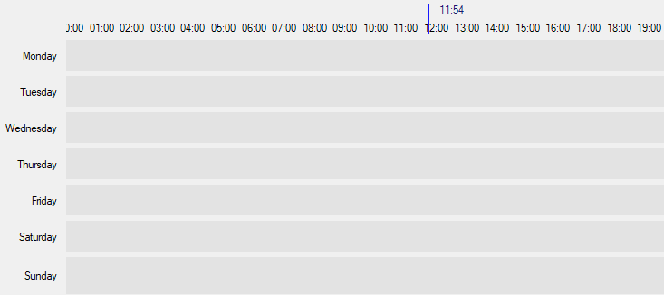

# Winforms-TimeWindowControlDemo
A quick one hour mockup of how you could achieve a Monday - Sunday timeline control in older winforms apps (vb.net)

Note: This was only cobbled together to illustrate an idea, many basic features are not currently implemented and it's not usable in it's current state.

